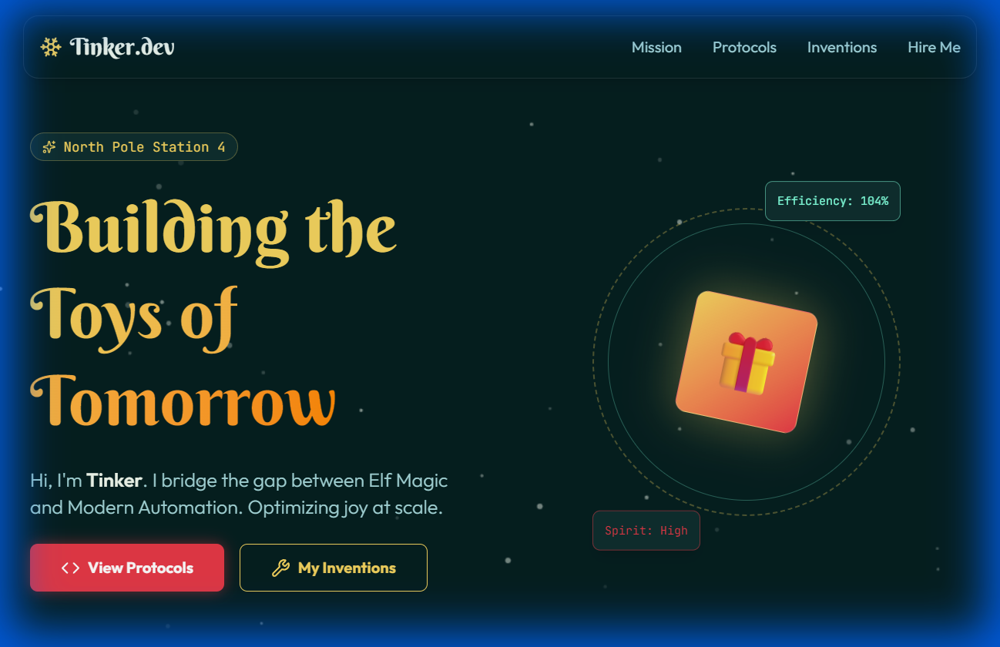

# 🎄 Tinker's Portfolio | Santa's Workshop Hiring Vibeathon

> "Bridging the gap between Elf Magic and Modern Automation using React & Tailwind."

Welcome to the digital portfolio of **Tinker**, a candidate for the Lead Innovation Elf position at North Pole Station 4. This project was built for the **Santa Hiring Vibeathon**, showcasing a blend of festive joy and serious frontend engineering.



## ✨ Features

*   **Midnight Workshop Theme**: A custom "Dark Mode" aesthetic using deep pine greens (`#051F20`), workshop slate, and accented with warm gold and candy red.
*   **Magical Animations**: 
    *   **Global Snowfall**: A custom canvas-based particle system.
    *   **Scroll Reveal**: Sections fade and slide in using `framer-motion`.
    *   **Interactive Cards**: Hover effects on project inventions.
*   **Storytelling UI**:
    *   **Pneumatic Tube Contact**: A playful form that "whooshes" messages to Santa.
    *   **Elf Security**: Try clicking "Demo" on a project to see the security protocols kicking in!
*   **Modern Tech**: Built with the latest generic tools for 2025.

## 🛠️ Tech Stack

*   **Core**: React 19 + Vite
*   **Styling**: **Tailwind CSS v4** (utilizing the new CSS-first configuration)
*   **Animation**: Framer Motion
*   **Icons**: Lucide React
*   **Fonts**: 'Berkshire Swash' (Headers) & 'Outfit' (Body)

## 🚀 Getting Started

To run this portfolio locally along with your own magical improvements:

1.  **Clone the workshop repo:**
    ```bash
    git clone https://github.com/yourusername/santa-hiring.git
    cd santa-hiring
    ```

2.  **Install the dependencies (Elves):**
    ```bash
    npm install
    ```

3.  **Start the Toy Factory (Dev Server):**
    ```bash
    npm run dev
    ```

4.  **Visit the North Pole:**
    Open `http://localhost:5173` in your browser.

## 📂 Project Structure

```
src/
├── assets/         # Generated images and static media
├── components/     # React components (Hero, About, Projects, etc.)
├── App.jsx         # Main application layout
├── index.css       # Tailwind v4 configuration & global styles
└── main.jsx        # Entry point
```

## 🎅 Design System

We utilize a custom tailwind configuration defined in `index.css`:

*   **Bg**: `bg-midnight-pine`
*   **Text**: `text-snow-drift`
*   **Accents**: `text-tech-gold`, `bg-candy-red`

---

*Made with 🍪 and Code by specialized Agentic Elves.*
